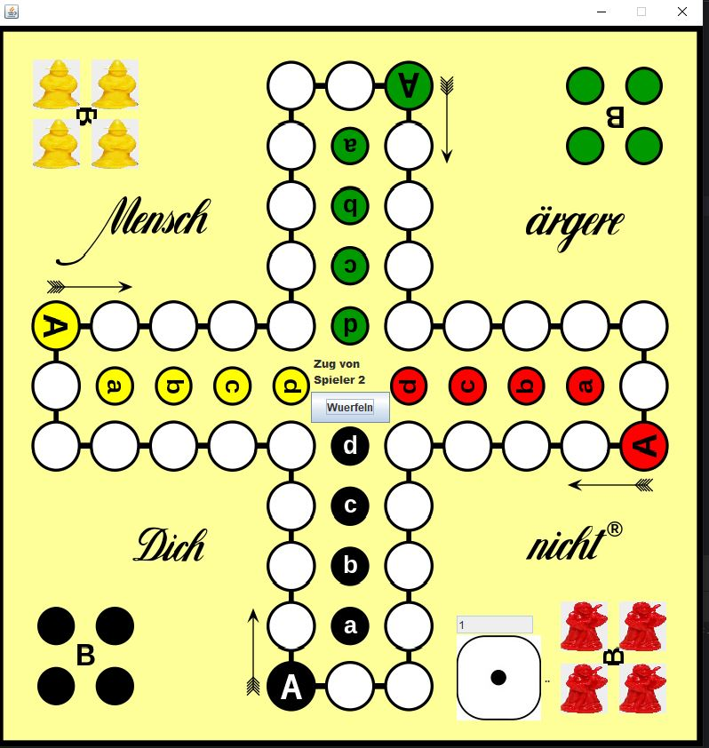

# 🧠 Mensch ärgere Dich nicht – Java GUI Version

Ein einfaches Java-Projekt mit GUI, das eine digitale Version des Brettspiels „Mensch ärgere Dich nicht“ umsetzt. Entwickelt im Rahmen meiner Umschulung als eines meiner ersten eigenen Projekte.



---

## 🎮 Features

- Spielbar mit **2 bis 4 Spieler:innen**
- **Graphische Benutzeroberfläche (GUI)** mit Spielfeld und Spielfiguren
- **Würfeln-Button** zur Steuerung des Spielverlaufs
- Einfache Logik zur Bewegung der Spielfiguren
- Basis-Spielmechanik analog zur Brettspiel-Vorlage

---

## 🛠️ Technologien

- **Java**
- **Swing** (GUI-Toolkit)
- Keine externen Abhängigkeiten

---

## 🚀 Starten des Spiels

### Voraussetzungen

- Java 8 oder höher

### Kompilieren und Starten (via Terminal)

```bash
javac -d bin src/**/*.java
java -cp bin Main
```

---

## 📦 Projektstruktur

```
.
├── src/                # Java-Quellcode
├── bin/                # Kompilierte Klassen (ausgeschlossen via .gitignore)
├── .idea/              # IntelliJ-Projektdateien (ausgeschlossen via .gitignore)
├── menschärgeredichnicht.JPG   # Screenshot
└── README.md           # Projektbeschreibung
```

---

## 🧑‍💻 Über mich

Dieses Projekt entstand im Rahmen meiner **Umschulung zum Fachinformatiker**, um Java und GUI-Programmierung zu erlernen. Inzwischen liegt mein Fokus in meinem Beruf als Fullstack-Entwickler auf **Python (FastAPI)** und **React mit TypeScript** – aber dieses Projekt zeigt gut meinen Startpunkt.

---

## 📌 Hinweis

Dies ist kein vollständiger Nachbau des Spiels – sondern eine **einfache Umsetzung der Grundfunktionen**, gedacht als Lernprojekt.
